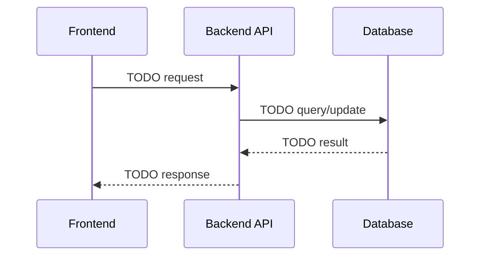

# 数据流

## DF-001：TODO: 流程名称

```mermaid
sequenceDiagram
  participant UI as Frontend
  participant API as Backend API
  participant DB as Database
  UI->>API: TODO request
  API->>DB: TODO query/update
  DB-->>API: TODO result
  API-->>UI: TODO response
```

- 关联 FLOW/NODE/DO/RD：TODO（来自 docs/product/workflows.md 与 rd-matrix.csv）
- 数据分类/敏感字段：TODO
- 同步/异步边界：TODO
- 超时、重试、幂等：TODO
- 事务/补偿/一致性：TODO
- 失败与告警：TODO
