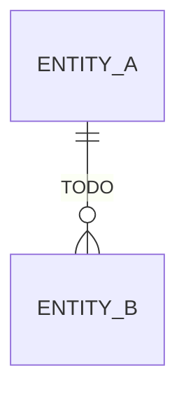

# 逻辑 ERD

```mermaid
erDiagram
  ENTITY_A ||--o{ ENTITY_B : TODO
```

| 实体 ID | 业务含义 | 数据所有者 | 关系/基数 | 生命周期 | 来源/状态 |
|---|---|---|---|---|---|
| ENT-001 | TODO | TODO | TODO | TODO | 待确认 |

本文件是逻辑模型基线，不是每个功能提案的最终物理 DDL。
