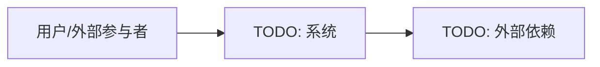

# 系统上下文与模块边界

```mermaid
flowchart LR
  User[用户/外部参与者] --> System[TODO: 系统]
  System --> External[TODO: 外部依赖]
```

## 边界与信任区

- 系统职责：TODO
- 非目标：TODO
- 外部系统及 SLA：TODO
- 认证/授权边界：TODO
- 主要模块及依赖方向：TODO
- 状态：待确认；审批人：TODO
