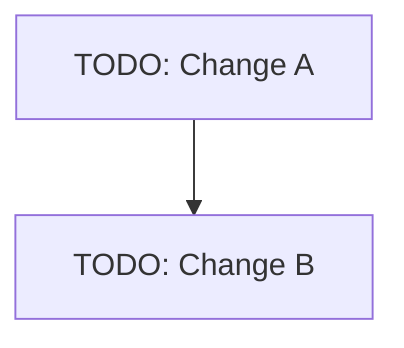

# Change 路线图

| Change ID | 目标/价值 | 范围/非目标 | US/AC | 依赖 | 风险/迁移 | 优先级/排序理由 | 验收人/状态 |
|---|---|---|---|---|---|---|---|
| TODO-change-id | TODO | TODO | TODO | TODO | TODO | TODO | 待规划 |

```mermaid
graph TD
  A[TODO: Change A] --> B[TODO: Change B]
```
